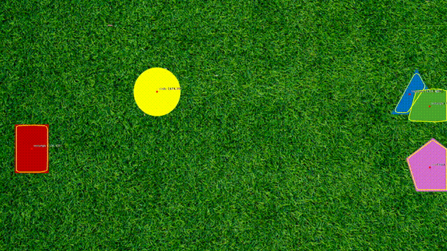
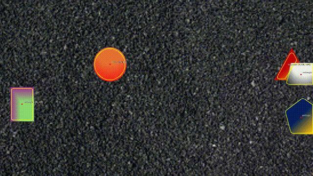
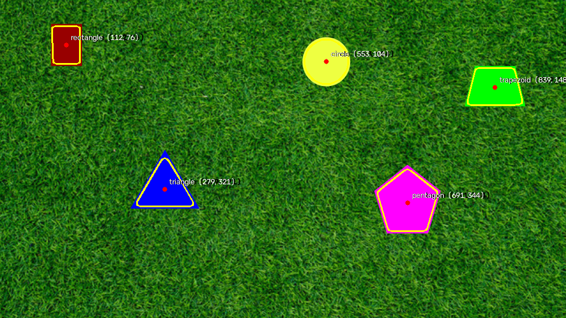

# PennAiR Software Challenge

Detecting solid shapes on textured backgrounds, tracing their outlines, and
marking their centers — on a static image, a video, and a video where the
background changes completely.

Everything is classical OpenCV (filtering, morphology, contours) — no pretrained
models.

|  |  |
|---|---|
| Part 1 – static image | [results/static.png](results/static.png) |
| Part 2 – grass video | [results/dynamic.mp4](results/dynamic.mp4) |
| Part 3 – background agnostic | [results/hard.mp4](results/hard.mp4) |





(gifs are compressed previews — the mp4s in `results/` are the real outputs)

## How to run

```sh
python3 -m venv .venv && source .venv/bin/activate
pip install -r requirements.txt

python run.py "media/PennAir 2024 App Static.png"
python run.py "media/PennAir 2024 App Dynamic.mp4" -o results/dynamic.mp4
python run.py "media/PennAir 2024 App Dynamic Hard.mp4" -o results/hard.mp4
```

`--no-show` skips the live preview window. The input videos are not committed
(GitHub file size limits) — drop the three challenge files into `media/`.

## Part 1: static image

My first attempt was the obvious one: mask out "green" in HSV and call
everything else a shape. It worked on this image and I threw it away almost
immediately, because it hardcodes the answer to the question ("what does the
background look like?") that part 3 asks you to stop assuming.

What I settled on instead: **the background is textured, the shapes are not.**
Grass is full of high-frequency detail; a printed solid shape is flat. So:

1. Subtract a Gaussian-blurred copy of the frame from itself. What's left is
   just the fine grain (grass blades, gravel specks). Smooth regions ≈ 0.
2. Square it and average it over a 15px window → a per-pixel "texture energy"
   map.
3. Threshold at a fraction (0.42) of the *median* energy of the frame. The
   median is dominated by background, so the cut self-calibrates per frame —
   nothing about "green" anywhere.
4. Morphological open/close to clean speckle, flood-fill from the corners to
   fill holes inside shapes, drop blobs that are too small or too big.

Centers come from contour moments (`m10/m00, m01/m00`), outlines from
`findContours` on the mask.



**Challenges:** my first texture measure was local standard deviation, which
died on part 3 — a color gradient has nonzero stddev even though it's smooth,
so the gradient shapes got holes punched in them. The blur-residual version
only responds to *high-frequency* variation, so a smooth ramp passes. This is
the single most important trick in the repo.

## Part 2: video

Same detector, run once per frame — the video is treated as a stream (each
frame processed as it arrives, no lookahead).

One performance change: at 1080p the pipeline was ~16ms/frame; detecting on a
2× downscaled frame and scaling the contours back up cut it to ~7ms with no
visible accuracy loss. That's comfortably real-time at 30fps.

**Challenges:** OpenCV's H.264 writer produced files nothing could open, so I
write mp4v and re-encode with ffmpeg after (also makes the files ~10x smaller
for GitHub).

## Part 3: background agnostic

This is where the texture-energy idea pays off: **nothing in the detector knows
what the background looks like**, only that it's the majority of the frame and
that it's textured. Running the *same code* on the hard video (gravel
background, gradient-shaded shapes, a white shape on dark gravel) works without
modification — the per-frame median threshold adapts on its own.

The one real addition for this part was **overlap splitting**. When two shapes
overlap they merge into one smooth blob. A merged blob is usually *concave*
(solidity < 0.9), so for those blobs only, I run k-means (k=2) on the pixel
colors in Lab space and split if the two clusters are well separated. Convexity
gating matters: without it, k-means would happily cut the blue/yellow gradient
pentagon in half.

**Honest limitations:** during fast motion the polygon labels flicker (motion
blur rounds the corners, so a trapezoid sometimes reads as rectangle for a few
frames), and when three shapes pile up the k=2 split can't separate all of
them. Centers and outlines stay solid though, which is what the task grades.

## Repo layout

```
detect.py     the whole algorithm (texture mask, contours, overlap split)
run.py        CLI for images and videos
results/      processed outputs (deliverables)
media/        challenge inputs (only the static png is committed)
```
